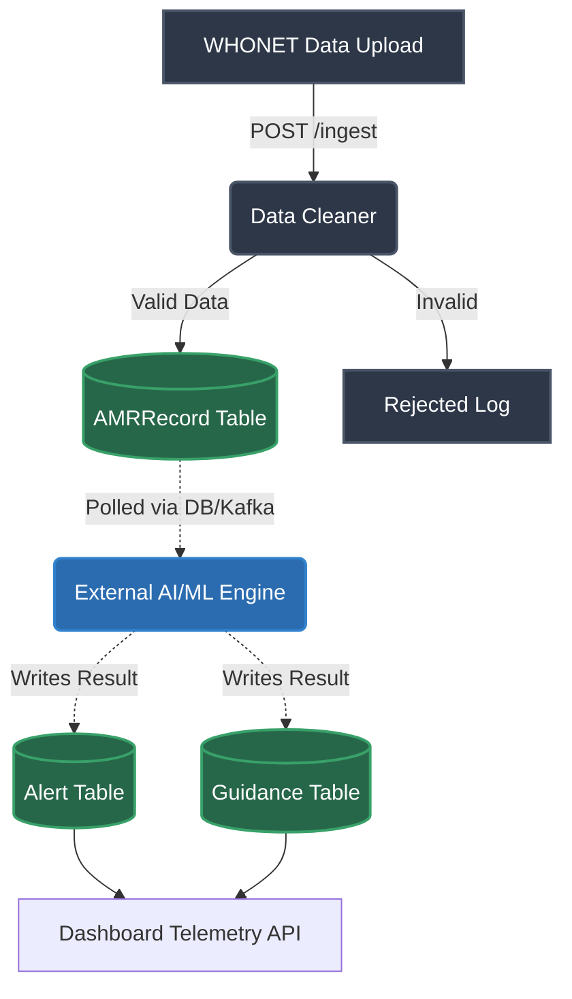

# AMR-Nexus Backend: Collaboration & Architecture Guide

Welcome to the **July 14, 2026, Revision 2** workflow. With 16 people on the team, preventing code overlap is critical. This document explicitly outlines the folder structure, team boundaries, and the step-by-step flow of how data moves through the system.

---

## 1. The Architectural Flow (How Data Moves)

Data flows strictly from **Ingestion** -> **Postgres** -> **External ML Engine**.
This backend handles the data backbone and the frontend API gateway. The AI/ML team processes our data externally and writes results (Alerts, Guidances) back to the database.



---

## 2. Team Boundaries: Pure Backend Focus

We have completely decoupled the AI/ML logic (Isolation Forest, Prophet, Claude) from this repository. The backend is now strictly divided into two distinct zones between Raph and Naomi.

### 🟢 Raph's Zone: Data Backbone & Security
**Focus:** Database integrity, API routing, data ingestion, and authentication.
**Core Folders & Files:**
- `src/api/backbone.py` (Ingestion Endpoints - unified under `/api/v1`)
- `src/api/auth.py` (Security & Login - generates valid JWT tokens for RBAC testing)
- `src/core/security.py` (Role-Based Access Control configuration)
- `src/models/entities.py` (Database schemas like `AMRRecord`)
- `src/services/ingestion/cleaner.py` (Data cleaning logic)
- `src/schemas/backbone.py` (Pydantic validation)

### 🔵 Naomi's Zone: Dashboard & Telemetry APIs
**Focus:** Exposing data to the frontend, compiling dashboard aggregations, and notifications.
**Core Folders & Files:**
- `src/api/intelligence.py` (Building complex SQL aggregations to serve telemetry to the frontend, e.g., `/intelligence/dashboard/summary`)
- `src/services/notifications/sms_service.py` (Wiring up Africa's Talking to send SMS alerts)
- `src/schemas/intelligence.py` (Frontend contract validation schemas)

### 🟡 Shared / Handoff Zones
**Focus:** Where Raph and Naomi's code interacts. Modifying these files requires communication.
- `src/models/entities.py`: Modifying DB schemas.
- `src/main.py`: App configuration.

---

## 3. Directory Map & File Ownership

Here is the exact folder structure and who is responsible for modifying each file:

```text
amr-nexus-backend/
├── docker-compose.yml              (Raph) Infrastructure setup
├── requirements.txt                (Shared) Add packages here
│
├── src/
│   ├── main.py                     (Shared) FastAPI entrypoint
│   │
│   ├── core/                       [RAPH ZONE]
│   │   ├── config.py               
│   │   └── security.py             
│   │
│   ├── models/                     [RAPH ZONE]
│   │   ├── base.py                 
│   │   └── entities.py             (Shared read, Raph write)
│   │
│   ├── schemas/                    
│   │   ├── backbone.py             (Raph)
│   │   └── intelligence.py         (Naomi)
│   │
│   ├── api/                        
│   │   ├── auth.py                 (Raph)
│   │   ├── backbone.py             (Raph)
│   │   └── intelligence.py         (Naomi)
│   │
│   ├── services/                   
│   │   ├── ingestion/              [RAPH ZONE]
│   │   │   └── cleaner.py          
│   │   │
│   │   └── notifications/          [NAOMI ZONE]
│   │       └── sms_service.py      
│   │
│   └── utils/                      
│       └── synthetic_gen.py        (Shared testing tool)
│
└── tests/                          [SHARED ZONE]
    └── test_api.py                 (Shared)
```

---

## 4. Collaboration Workflow (How to Work Together)

Follow this process to keep the project moving smoothly toward the July 14 demo:

1. **Branch Naming:**
   - Raph: `feat/raph-data-cleaner` or `fix/raph-auth-bug`
   - Naomi: `feat/naomi-telemetry` or `fix/naomi-dashboard-contract`

2. **Database Changes:**
   - If Naomi needs a new column in the database (e.g., to expose a new metric for the frontend), she must ping Raph. Raph will update `entities.py` and run the Alembic migration. **Naomi should never edit `entities.py` directly.**

3. **Testing:**
   - Always run the test suite locally before pushing: `source venv/bin/activate && pytest -v`
   - Do not break the tests in the other person's zone.
