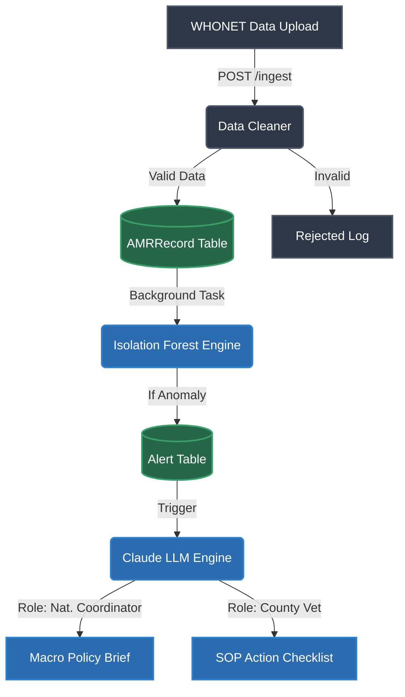

# AMR-Nexus Backend: Collaboration & Architecture Guide

Welcome to the **July 14, 2026, Revision 2** workflow. With 16 people on the team, preventing code overlap is critical. This document explicitly outlines the folder structure, team boundaries, and the step-by-step flow of how data moves through the system.

---

## 1. The Architectural Flow (How Data Moves)

Data flows strictly from **Ingestion** -> **Intelligence** -> **Action**.



---

## 2. Team Boundaries: Who Owns What?

To avoid merge conflicts, we have divided the codebase into strict zones.

### 🟢 Raph's Zone: Infrastructure & Backbone
**Focus:** Database integrity, API routing, data ingestion, and authentication.
**Core Folders & Files:**
- `src/api/backbone.py` (Ingestion Endpoints)
- `src/api/auth.py` (Security & Login)
- `src/models/entities.py` (Database schemas like `AMRRecord`)
- `src/services/ingestion/cleaner.py` (Data cleaning logic)
- `src/schemas/backbone.py` (Pydantic validation)

### 🔵 Naomi's Zone: Intelligence & ML
**Focus:** Prophet forecasting, Anomaly Detection, and LLM Advisories.
**Core Folders & Files:**
- `src/services/ml_engine/anomaly_detector.py` (Isolation Forest)
- `src/services/ml_engine/forecaster.py` (Facebook Prophet)
- `src/services/intelligence/llm_advisory.py` (Claude LLM Prompts)
- `src/schemas/intelligence.py` & `guidance.py` (Outbound ML formats)

### 🟡 Shared / Handoff Zones
**Focus:** Where Raph and Naomi's code interacts. Modifying these files requires communication.
- `src/api/intelligence.py`: Raph builds the route, Naomi provides the ML function.
- `src/models/entities.py`: Naomi needs to add fields to `Alert` or `Guidance`? She must ask Raph to update the SQLAlchemy model.
- `src/main.py`: App configuration.

---

## 3. Directory Map & File Ownership

Here is the exact folder structure and who is responsible for modifying each file:

```text
amr-nexus-backend/
├── docker-compose.yml              (Raph) Infrastructure setup
├── requirements.txt                (Shared) Add packages here
│
├── src/
│   ├── main.py                     (Shared) FastAPI entrypoint
│   │
│   ├── core/                       [RAPH ZONE]
│   │   ├── config.py               
│   │   └── security.py             
│   │
│   ├── models/                     [RAPH ZONE]
│   │   ├── base.py                 
│   │   └── entities.py             (Shared read, Raph write)
│   │
│   ├── schemas/                    
│   │   ├── backbone.py             (Raph)
│   │   ├── intelligence.py         (Naomi)
│   │   └── guidance.py             (Naomi)
│   │
│   ├── api/                        
│   │   ├── auth.py                 (Raph)
│   │   ├── backbone.py             (Raph)
│   │   └── intelligence.py         (Shared)
│   │
│   ├── services/                   
│   │   ├── ingestion/              [RAPH ZONE]
│   │   │   └── cleaner.py          
│   │   │
│   │   ├── ml_engine/              [NAOMI ZONE]
│   │   │   ├── anomaly_detector.py 
│   │   │   └── forecaster.py       
│   │   │
│   │   └── intelligence/           [NAOMI ZONE]
│   │       └── llm_advisory.py     
│   │
│   └── utils/                      
│       └── synthetic_gen.py        (Shared testing tool)
│
└── tests/                          [SHARED ZONE]
    ├── test_api.py                 (Raph)
    └── test_intelligence.py        (Naomi)
```

---

## 4. Collaboration Workflow (How to Work Together)

Follow this process to keep the project moving smoothly toward the July 14 demo:

1. **Branch Naming:**
   - Raph: `feat/raph-data-cleaner` or `fix/raph-auth-bug`
   - Naomi: `feat/naomi-shap-values` or `fix/naomi-llm-prompt`

2. **The Handoff Process (Background Tasks):**
   - **Raph** is responsible for writing the FastAPI background task that triggers Naomi's code.
   - **Raph** will call `AMRAnomalyEngine.run_detection_pipeline(record_ids)`.
   - **Naomi** must ensure that her `run_detection_pipeline` method accepts exactly a list of IDs (`List[int]`) and handles all database queries internally. This is your strict contract.

3. **Database Changes:**
   - If Naomi needs a new column in the database (e.g., to store a new ML metric), she must ping Raph. Raph will update `entities.py` and run the Alembic migration. **Naomi should never edit `entities.py` directly.**

4. **Testing:**
   - Always run the test suite locally before pushing: `source venv/bin/activate && pytest -v`
   - Do not break the tests in the other person's zone.
